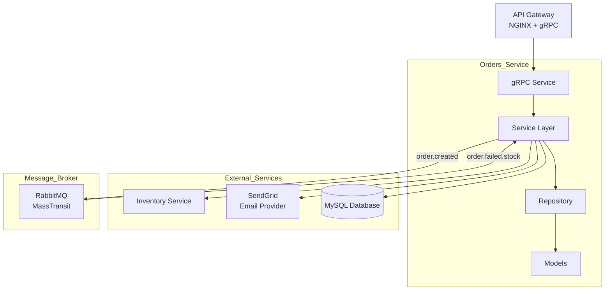

# Censudex - Orders Service

Servicio encargado de la gestión completa de pedidos dentro de la plataforma Censudex. Forma parte de la arquitectura de microservicios y administra la creación, seguimiento, actualización y cancelación de pedidos, utilizando MySQL como base de datos. Se integra con el Inventory Service mediante RabbitMQ para validar stock y coordinar procesos asíncronos, y emplea SendGrid para enviar notificaciones automáticas a los clientes.

---

## Arquitectura y Patrón de Diseño

### Arquitectura: Microservicios + Event-Driven

El Orders Service implementa:

- Arquitectura de capas (Layered Architecture)
- Comunicación **síncrona** mediante **gRPC**
- Comunicación **asíncrona** mediante **RabbitMQ (MassTransit)**
- Base de datos independiente (**MySQL**)
- Notificaciones automáticas mediante **SendGrid**



### Patrones de Diseño Implementados

1. **Repository Pattern:** Separa acceso a datos
2. **Dependency Injection:** Desacopla dependencias del servicio
3. **DTO Pattern:** Transferencia segura entre capas
4. **Unit of Work (implícito en EF Core):** Manejo transaccional
5. **Event-Driven Architecture:** Comunicación asíncrona con RabbitMQ (orden → inventario)
6. **Consumer Pattern (MassTransit):** Escucha de eventos externos
7. **gRPC Service Pattern:** → API binaria optimizada y tipada

## Tecnologías Utilizadas

- **Framework:** ASP.NET Core 9.0
- **Comunicación Síncrona:** gRPC
- **Comunicación Asíncrona:** RabbitMQ + MassTransit
- **Base de Datos:** MySQL
- **ORM:** Entity Framework Core
- **Email Provider:** SendGrid
- **Contenedores:** Docker
- **Versionado:** Git + Conventional Commits

## Modelo de Datos

### Entidad Order (MySQL Table)

```
{
  "Id": "UUID v4",
  "OrderDate": "DateTime",
  "UserId": "UUID v4",
  "Items": "List<OrderItem>",
  "Status": "string",
  "TotalAmount": "decimal",
  "TrackingNumber": "string (nullable)",
  "DeliveryDate": "DateTime (nullable)",
  "CancellationReason": "string (nullable)"
}
```

### Entidad OrderItem (MySQL Table)

```
{
  "Id": "UUID v4",
  "ProductId": "UUID v4",
  "ProductName": "string",
  "Quantity": "int",
  "UnitPrice": "int",
  "SubTotal": "int",
  "OrderId": "UUID v4",
  "Order": "Order (nullable)"
}
```

### Estados de Pedido:

- **pendiente:** El pedido fue recibido y espera ser procesado.
- **en procesamiento:** El pedido está siendo preparado.
- **enviado** El pedido fue despachado y está en camino.
- **entregado:** El pedido llegó al cliente.
- **cancelado:** El pedido fue anulado y no será completado.

## Endpoints de la API

### gRPC Service (Puerto 5001)

| Método              | Descripción                       | Request                  | Response                  |
| ------------------- | --------------------------------- | ------------------------ | ------------------------- |
| `CreateOrder`       | Crear pedido                      | CreateOrderRequest       | CreateOrderResponse       |
| `CheckOrderStatus`  | Consultar el estado de un pedido  | CheckOrderStatusRequest  | CheckOrderStatusResponse  |
| `UpdateOrderStatus` | Actualizar el estado de un pedido | UpdateOrderStatusRequest | UpdateOrderStatusResponse |
| `CancelOrder`       | Cancelar un pedido                | CancelOrderRequest       | CancelOrderResponse       |
| `GetOrders`         | Obtener pedidos                   | GetOrdersRequest         | GetOrdersResponse         |

### Eventos RabbitMQ

| Tipo      | Mensaje                 | Exchange     | Routing Key        |
| --------- | ----------------------- | ------------ | ------------------ |
| Publicado | OrderCreatedMessage     | order_events | order.created      |
| Consumido | OrderFailedStockMessage | order_events | order.failed.stock |

## Instalación y Configuración

### Requisitos Previos

- **.NET 9 SDK**: [Download](https://dotnet.microsoft.com/download/dotnet/9.0)
- **Docker Desktop**: [Download](https://www.docker.com/products/docker-desktop)
- **MySQL Server 8.4.6**: [Download](https://downloads.mysql.com/archives/community/)
- **Cuenta SendGrid**: [Crear cuenta](https://sendgrid.com/en-us)
- **Visual Studio Code**: [Download](https://code.visualstudio.com/)

### 1. Clonar el Repositorio

```bash
git clone https://github.com/carlos44440/censudex-orders-service.git

cd orders-service
```

### 2. Configurar Variables de Entorno

Crea un archivo **.env** en la raíz del proyecto:

```env
# Database
CONNECTION_STRING=Server=localhost;Port=2000;Database=orders;User=root;Password=root;

# Services
CLIENT_SERVICE_URL=http://localhost:
PRODUCT_SERVICE_URL=http://localhost:
INVENTORY_SERVICE_URL=http://localhost:5001

# SendGrid
SENDGRID_API_KEY=YourSendGridApiKey
SENDER_EMAIL=YourSenderEmail
SENDER_NAME=YourSenderName

# RabbitMQ
RABBITMQ_HOST=localhost
RABBITMQ_USERNAME=guest
RABBITMQ_PASSWORD=guest
```

**Nota importante:**

- **Configurar la instalación de MySQL Server:** Establecer el usuario y la contraseña como "root".
  Configurar el puerto en "2000" y el modo en Standalone MySQL Server.
- **Crear un sender en SendGrid:** Debes crear un sender, accediendo a `Settings` -> `Sender Authentication` -> `Single Sender Verification`.
- **Crear tu Api key de SendGrid:** Accede a `Email API` -> `Integration Guide` -> `Web API` -> `C#` -> `Create an API key`.

### 3. Instalar Dependencias

```bash
dotnet restore
```

### 4. Instalar Entity Framework

```bash
dotnet tool install --global dotnet-ef
```

### 5. Iniciar RabbitMQ con Docker

```bash
docker run -d --hostname my-rabbit --name rabbitmq -p 5672:5672 -p 15672:15672 rabbitmq:3-management
```

Accede a la interfaz web: http://localhost:15672 (usuario: `guest`, password: `guest`)

### 6. Compilar el Proyecto

```bash
dotnet build
```

### 7. Ejecutar el Proyecto

```bash
dotnet run
```

El servicio estará disponible en:

- **gRPC:** http://localhost:50051

## Ejemplos de Uso

### Probar gRPC con Postman

1. En Postman, selecciona **New → gRPC Request**
2. URL del servidor: `localhost:50051`
3. Importa el archivo `Protos/order.proto`
4. Selecciona el método deseado
5. Incluir el JWT a la request, accede a Authorization -> Auth Type: Bearer Token
6. Ingresa el JSON del request
7. Click en **Invoke**

### Endpoints

Los siguientes servicios están disponibles vía gRPC para comunicación con el API Gateway:

#### 1. Create Order

**Request:**

```json
{
  "items": [
    {
      "productId": "019a3bb0-158d-795f-978f-cbef1a81fdc1",
      "quantity": 10
    },
    {
      "productId": "019a3bb0-158d-795f-978f-cbef1a81fdc4",
      "quantity": 12
    }
  ]
}
```

**Response:**

```json
{
  "items": [
    {
      "productId": "019a3bb0-158d-795f-978f-cbef1a81fdc1",
      "productName": "Product",
      "quantity": 10,
      "unitPrice": 12,
      "subTotal": 120
    },
    {
      "productId": "019a3bb0-158d-795f-978f-cbef1a81fdc4",
      "productName": "Product",
      "quantity": 12,
      "unitPrice": 12,
      "subTotal": 144
    }
  ],
  "id": "5fa571dc-4b93-4ccf-acb5-f1f294d2863e",
  "orderDate": "2025-11-13T23:26:19.9852331Z",
  "userId": "b8f16a9b-ef59-41e2-8e8f-3db1f14d0e39",
  "status": "pendiente",
  "totalAmount": 264,
  "trackingNumber": "TRK-20251113-659224",
  "deliveryDate": "2025-12-13T23:26:19.9952543Z",
  "cancellationReason": ""
}
```

#### 2. Check Order Status

**Request:**

```json
{
  "orderId": "5fa571dc-4b93-4ccf-acb5-f1f294d2863e"
}
```

**Response:**

```json
{
  "status": "pendiente"
}
```

#### 3. Update Order Status

**Request:**

```json
{
  "orderId": "5fa571dc-4b93-4ccf-acb5-f1f294d2863e",
  "status": "EN PROCESAMIENTO"
}
```

**Response:**

```json
{
  "items": [],
  "id": "5fa571dc-4b93-4ccf-acb5-f1f294d2863e",
  "orderDate": "2025-11-13T23:26:19.9852330",
  "userId": "b8f16a9b-ef59-41e2-8e8f-3db1f14d0e39",
  "status": "en procesamiento",
  "totalAmount": 264,
  "trackingNumber": "TRK-20251113-659224",
  "deliveryDate": "2025-12-13T23:26:19.9952540",
  "cancellationReason": ""
}
```

#### 4. Cancel Order

**Request:**

```json
{
  "requestCancelOrder": {
    "orderId": "5fa571dc-4b93-4ccf-acb5-f1f294d2863e",
    "cancellationReason": "ME ARREPENTI DE COMPRAR ESTO"
  }
}
```

**Response:**

```json
{
  "items": [],
  "id": "5fa571dc-4b93-4ccf-acb5-f1f294d2863e",
  "orderDate": "2025-11-13T23:26:19.9852330",
  "userId": "b8f16a9b-ef59-41e2-8e8f-3db1f14d0e39",
  "status": "cancelado",
  "totalAmount": 264,
  "trackingNumber": "TRK-20251113-659224",
  "deliveryDate": "2025-12-13T23:26:19.9952540",
  "cancellationReason": "ME ARREPENTI DE COMPRAR ESTO"
}
```

#### 5. Get Orders

**Request:**

```json
{
  "queryObject": {
    "orderId": "557fe6b4-2f03-447a-b98d-4fdac50c7b49",
    "customerId": "b8f16a9b-ef59-41e2-8e8f-3db1f14d0e39",
    "initialOrderDate": "2025-11-12",
    "finalOrderDate": "2025-11-13"
  }
}
```

**Response:**

```json
{
  "orderDto": [
    {
      "items": [
        {
          "productId": "019a3bb0-15b6-74f7-b877-2a3d05587047",
          "productName": "Product",
          "quantity": 21,
          "unitPrice": 12,
          "subTotal": 252
        },
        {
          "productId": "019a3bb0-15b6-7455-97d2-1eae07639b58",
          "productName": "Product",
          "quantity": 2111,
          "unitPrice": 12,
          "subTotal": 25332
        },
        {
          "productId": "019a3bb0-158d-795f-978f-cbef1a81fdc6",
          "productName": "Product",
          "quantity": 1222,
          "unitPrice": 12,
          "subTotal": 14664
        }
      ],
      "id": "557fe6b4-2f03-447a-b98d-4fdac50c7b49",
      "orderDate": "2025-11-12T20:10:49.2969680",
      "userId": "b8f16a9b-ef59-41e2-8e8f-3db1f14d0e39",
      "status": "cancelado",
      "totalAmount": 40248,
      "trackingNumber": "TRK-20251112-221854",
      "deliveryDate": "2025-12-12T20:10:49.3161600",
      "cancellationReason": "Insufficient stock for one or more products"
    }
  ]
}
```
